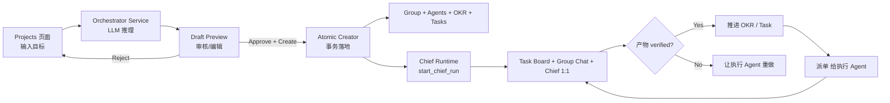

# 01 - Product Overview

> **状态**: 🟡 DRAFT
> **范围**: Intent-Driven Project Orchestrator 模块

---

## 1. 一句话定位

让 Clawith 任何租户的**普通用户**用一句自然语言描述目标，平台自动生成 Group + Agents + OKR + Tasks，并派一个 **Chief（PM）Agent** 持续驱动执行，直到目标完成。

---

## 2. 核心用户故事

### US-001：从一句话到可执行项目
**作为** 任意租户用户
**我希望** 在 Projects 页面输入一句目标（例如「帮我做一个出海 SaaS 获客方案」）
**以便于** 平台自动产出包含 Group、Agents、OKR、Task Board 的完整项目，免去手动配置。

**验收**：
- 输入框允许自然语言（不限长度，但建议 5-500 字）。
- 点击「生成」后进入 Draft Preview 页，可见 LLM 生成的结构化方案。
- 用户可编辑 Group 名、描述、Agent 角色、Task 标题。
- 选择 template visibility（user_private / tenant_private / public）。
- 点击「Approve & Create」后跳转进入 Group 详情页，群主 Chief 已上线。

### US-002：近期 Draft 续接
**作为** 经常尝试目标的运营人员
**我希望** 看到最近 6 个 Draft（含 status 标识），能一键回到 Draft Preview 续审
**以便于** 不需要从头输入。

### US-003：Chief Runtime 持续调度
**作为** 项目所有者
**我希望** Chief Agent（群主）在我离开后依然推进任务、审核执行产物、推进 OKR
**以便于** 我下次回来看到最新进展。

### US-004：执行 Agent 动态补任务
**作为** 项目所有者
**我希望** 执行 Agent 在执行过程中可新建 Task Card，Chief 会重新审核并派单
**以便于** 真实工作中临时发现的任务不被遗漏。

### US-005：模板可见性审核
**作为** 平台管理员 / 租户管理员
**我希望** LLM 生成的新 Agent 模板需要按 visibility 走审核流
**以便于** 平台 / 租户级别的模板不污染公共库。

---

## 3. 业务范围（In / Out）

### 3.1 In Scope
- 自然语言意图 → Draft（LLM 多阶段推理）
- Draft Preview UI（编辑 / Approve / Reject / Visibility 选择）
- AtomicCreator（幂等落地 Group / Agents / OKR / Tasks / Chief Runtime）
- Chief Runtime（长生命周期，事件驱动）
- Task Board（Kanban + DAG 依赖）
- Group Chat（含 Chief 1:1 Chat 子会话）
- 模板 registry + 可见性审核
- 阶段产物沉淀到 group_file

### 3.2 Out of Scope（本文档不覆盖）
- 其他 Agent 直接对话（Chat、Plaza 等）
- 触发器系统（Triggers / Heartbeats）
- RBAC 全量
- 多渠道消息通道（Slack / Discord / Feishu / DingTalk / 飞书 / 企业微信）
- Experience / Skill / Tool 安装市场
- 计费 / 配额
- SSO / OAuth

---

## 4. 术语表

| 术语 | 定义 | 同义 |
|---|---|---|
| **Draft** | LLM 生成的「项目提案」，等待用户审核 | 草稿 |
| **Orchestrator Service** | 生成 Draft 的 LLM 服务（IntentAnalyzer → AgentSelector → GroupPlanner） | 编排服务 |
| **Atomic Creator** | 把 Draft 落地为真实 Group / Agents / OKR / Tasks 的事务式组件 | 原子创建器 |
| **Chief / Chief Agent** | 群主 Agent（PM 角色），只审核 + 调度 + 激活，不直接干活 | PM、Owner |
| **Chief Runtime** | Chief Agent 的长生命周期运行时（`run_kind="orchestrator"`） | 群主运行时 |
| **Task Card** | 看板上的单张卡片 | 任务卡 |
| **Task Board** | Kanban 视图，含 DAG 依赖 | 看板 |
| **Group** | 多个 Agent + 多用户的协作空间（项目载体） | 群、项目组 |
| **OKR** | Objective + Key Results（含 acceptance_artifact_paths） | 目标管理 |
| **Stage** | OKR 阶段，产物 verified 后推进 | 阶段 |
| **Template Visibility** | 模板可见性：`user_private` / `tenant_private` / `public` | 可见性 |
| **Chief 1:1 Chat** | 用户与 Chief 的专属子会话（独立 Session，关联 Chief Run） | 1:1 会话 |
| **progress signal** | 推进 OKR / Task 的事件（非时间触发） | 进度信号 |
| **Run** | AgentRun 的实例（Agent 的一次生命周期） | 运行 |
| **Command** | 写进 `agent_run_commands` 的 start / resume / cancel | 命令 |

---

## 5. 角色

| 角色 | 在本模块中的能力 |
|---|---|
| **平台普通用户** | 创建 Draft、审核自己的 Draft、查看项目 |
| **租户管理员（org_admin）** | 审批 `tenant_private` 模板；查看租户内全部 Draft |
| **平台管理员（platform_admin）** | 审批 `public` 模板；可查看全平台统计 |
| **Chief Agent** | 监听 task_board_events、审核产物、推进 OKR、派单 |
| **执行 Agent** | 接单、执行、写产物、可能新增 Task Card |
| **Human User (在 Group 内)** | 1:1 与 Agent 聊天、审 Chief 决议 |

---

## 6. 关键业务规则

### BR-001：Draft 幂等性
同一 Draft 一旦 `status='consumed'`，不能再次创建 Group（避免重复资源）。

### BR-002：进度驱动优先
所有 Agent 行为的默认触发器是 **progress signal**（task_board_events、group_file_events），不是时间字段。

### BR-003：时间字段全部 opt-in
- `due_date`、`scheduled_at`、`target_window_start/end`、`period_start/end` **只在用户显式输入时落库**
- Agent 行为不强制绑定时间字段

### BR-004：C1 不变量
- API 路由**只能**通过 `RuntimeCommandIntake` 启动 Chief Run
- API / Product service **不能**直接调用 LangGraph 节点
- `chief_runs` 表只存元数据；LangGraph Checkpoint 才是唯一真相

### BR-005：模板可见性审核
- `user_private`：无需审核，立即生效
- `tenant_private`：需 `org_admin` 审核后共享
- `public`：需 `platform_admin` 审核，影响所有租户

### BR-006：Chief Runtime 失败容忍
- 单次循环失败不退出
- `FAILURE_THRESHOLD = 5` 连续失败 → degraded 状态
- `COOLDOWN_SECONDS = 300` 后重试
- `status='stopped'` 才退出

### BR-007：动态任务
Task Card 不在 Draft 创建时穷举；Agent 协作中可新增，Chief 重新审核。

---

## 7. 关键用户体验流程（高层）

---

## 8. 非功能性需求

| 项 | 要求 |
|---|---|
| 租户隔离 | 所有新表 `tenant_id NOT NULL`，DAO 强制 scope（C2） |
| 并发 | 后端 worker `AGENT_RUNTIME_COMMAND_CONCURRENCY` 默认 10 |
| 幂等 | AtomicCreator 用 `draft_id` 作幂等键；Chief action 用 `event_id` 作幂等键 |
| 可观测性 | 所有事件落 `task_board_events`；audit log 覆盖 Draft 创建/审核/落地 |
| 国际化 | 前端 i18n（zh-CN、en、ja、ko、es、ar）已支持；Draft 内容跟随用户输入语言 |
| 数据库 | PostgreSQL 15+（生产）/ SQLite（测试）；所有新表无 FK |

---

## 9. 已知 Bug / 待修复

- 🟡 **BUG-01-A**: 用户故事 US-003 中「Chief Runtime 持续调度」目前是否真在运行（事件驱动链路是否已贯通），需要看 `event_listener.py` 与 `command_handler.py` 的连接确认 — **推测根因**：之前 `atomic_creator.py` 被标记为 LEGACY，需要看 fix commit `5aa39f38` 之后是否已修复。
- 🟡 **BUG-01-B**: 用户故事 US-005 的「模板可见性审核」流程（`template_registry.py`）目前路由未被自动挂载（README 提到），需要在文档中明确这是「未激活」状态。
- 🟡 **BUG-01-C**: US-001 中的「可编辑 Group 名、描述、Agent 角色、Task 标题」实际 UI 行为需与 `DraftPreview.tsx` 对齐确认（看到 `visibility` state 与 radio card 已知 OK；编辑能力是否齐全未完整验证）。