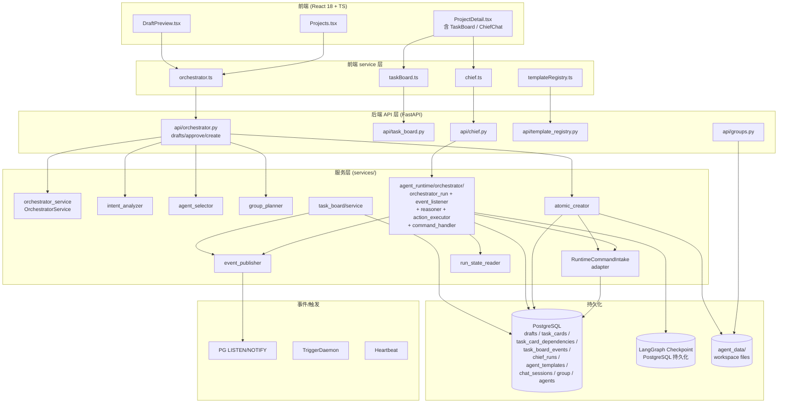
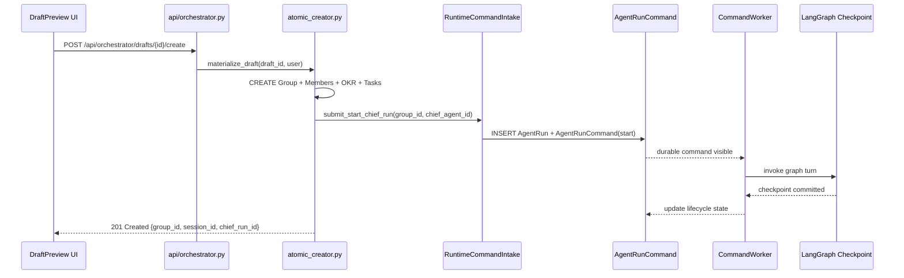

# 02 - Architecture & Runtime

> **状态**: 🟡 DRAFT
> **范围**: Intent-Driven Project Orchestrator 模块

---

## 1. 系统架构图

---

## 2. 四类事实分离（C1 不变量）

> **CRITICAL INVARIANT (C1)**: Product projections must NEVER become a second Agent execution state machine.

| 事实类型 | 拥有者 | 写入入口 | 禁止操作 |
|---|---|---|---|
| 1️⃣ Product Records | Clawith product 表 | API / Service 直写 | 任何修改 checkpoint 生命周期的尝试 |
| 2️⃣ Accepted Command Inbox | `agent_run_commands` 表 | **只能** `RuntimeCommandIntake` | 直接调用 graph 节点 |
| 3️⃣ Execution Lifecycle | LangGraph Checkpoint | graph 自身 / worker | API / product service 直接写 |
| 4️⃣ User Delivery | Product-side reconciliation | 独立的 delivery service | 修改 1/2/3 中的真相 |

### 2.1 Orchestrator 模块如何映射四类

| Orchestrator 实体 | 事实类型 | 说明 |
|---|---|---|
| `drafts` 表 | 1️⃣ Product | 提案元数据；不是执行真相 |
| `task_cards`、`task_board_events` | 1️⃣ Product | 产品视角的看板；不复制 checkpoint |
| `chief_runs` 表 | 1️⃣ Product | **只存元数据**（group_id、status、last_event_at）；运行真相在 LangGraph Checkpoint |
| `agent_run_commands`（Chief start_chief_run） | 2️⃣ Command Inbox | Chief 启动的入口 |
| LangGraph Checkpoint | 3️⃣ Execution | Chief Runtime 推进状态机的唯一真相 |
| Group Chat / Chief 1:1 Chat / 产物推送 | 4️⃣ Delivery | 由 delivery / reconciliation 服务负责；幂等、可重试 |

---

## 3. 关键架构决策

### 3.1 Persistent Orchestrator（Chief Runtime）
- **不是** 一次性脚本；是 `run_kind="orchestrator"` 的长生命周期 Run
- 监听 `task_board_events`（PG LISTEN）+ `group_file_events`
- 持续循环：EventListener → Reasoner → ActionExecutor
- `FAILURE_THRESHOLD=5` 连续失败 → degraded；`COOLDOWN_SECONDS=300` 后重试

### 3.2 进度驱动优先（无时间）
- 所有 Agent 行为默认由 progress signal 驱动
- 时间字段（`due_date`、`scheduled_at`、`target_window_*`、`period_*`）**全部 opt-in**
- 旧 Trigger（cron / interval）只在用户显式启用时使用

### 3.3 C3 幂等性
| 操作 | 幂等键 |
|---|---|
| AtomicCreator 创建 Group/Agents/OKR/Tasks | `draft_id` |
| Chief Action 处理 task_board_event | `event_id` |
| Chief Runtime restart | `chief_run_id`（避免重复启动） |

### 3.4 RuntimeCommandIntake 是唯一启动入口

### 3.5 反模式（被禁止）
- ❌ API 路由直接调用 LangGraph 节点
- ❌ Product service 修改 checkpoint 字段
- ❌ Product 表承担「第二套执行状态机」
- ❌ Chief Runtime 同步等待 LLM（必须异步 + Reasoner 返回 ActionPlan）

---

## 4. C1-C6 宪法对齐表

| 条款 | 在 Orchestrator 中的体现 |
|---|---|
| **C1 Runtime Boundary Isolation** | `RuntimeCommandIntake` 是 Chief 启动唯一入口；API 不调 graph 节点；`chief_runs` 只存元数据 |
| **C2 Strict Multi-Tenant Scope** | 所有新表 `tenant_id NOT NULL`；DAO 强制 `.where(tenant_id==)`；cache key 前缀 `tenant:{id}:` |
| **C3 Idempotent Side Effects & Reconciliation** | AtomicCreator 用 `draft_id`；Chief Action 用 `event_id`；checkpoint 才是真相；delivery 幂等 |
| **C4 Client & Gateway Wrapper** | 前端走 `src/api/request.ts`，不直接 import axios；后端 LLM 走统一 proxy |
| **C5 DB Standards (No FK + N+1 Prevention)** | 所有新表无物理 FK；批量查用 `in_()` + `selectinload` |
| **C6 Modularity** | 单文件 ≤ 1000 行（后端）/ 600 行（前端）；助手放 `core/` / `utils/` / `helpers/` |

---

## 5. 关键目录与文件清单

### 5.1 后端新增/修改

| 路径 | 角色 |
|---|---|
| `backend/app/api/orchestrator.py` | Draft 路由（**当前被 git 修改**） |
| `backend/app/api/task_board.py` | 看板路由（未自动挂载） |
| `backend/app/api/chief.py` | Chief Runtime 控制路由 |
| `backend/app/api/template_registry.py` | 模板审核路由（未自动挂载） |
| `backend/app/api/groups.py` | Group 路由（**当前被 git 修改**） |
| `backend/app/services/orchestrator/` | 提案生成服务族 |
| `backend/app/services/orchestrator/atomic_creator.py` | 落地（已被标 LEGACY，等待替代实现） |
| `backend/app/services/agent_runtime/orchestrator/` | Chief Runtime 实现 |
| `backend/app/services/task_board/` | Task Board 服务族 |
| `backend/app/services/agent_template/registry/` | 模板可见性 + 审核 + LLM 生成 |
| `backend/app/models/draft.py` | `drafts` 模型 |
| `backend/app/models/task_card.py` | `task_cards` 模型 |
| `backend/app/models/task_card_dependency.py` | `task_card_dependencies` 模型 |
| `backend/app/models/task_board_event.py` | `task_board_events` 模型 |
| `backend/app/models/chief_run.py` | `chief_runs` 模型 |
| `backend/alembic/versions/v1_0_0_g001_create_drafts.py` | drafts 表迁移 |
| `backend/alembic/versions/v1_0_0_g002_create_task_cards.py` | task_cards 表迁移 |
| `backend/alembic/versions/v1_0_0_g003_create_task_card_dependencies.py` | 依赖迁移 |
| `backend/alembic/versions/v1_0_0_g004_create_task_board_events.py` | 事件表迁移 |
| `backend/alembic/versions/v1_0_0_g005_create_chief_runs.py` | chief_runs 迁移 |
| `backend/alembic/versions/v1_0_0_g006_extend_agent_templates.py` | 扩展 templates |
| `backend/alembic/versions/v1_0_0_g007_extend_chat_sessions_chief_run.py` | 扩展 chat_sessions |

### 5.2 前端新增/修改

| 路径 | 角色 |
|---|---|
| `frontend/src/services/orchestrator.ts` | 提案 API（**当前被 git 修改**） |
| `frontend/src/services/taskBoard.ts` | 看板 API |
| `frontend/src/services/chief.ts` | Chief 控制 API |
| `frontend/src/services/templateRegistry.ts` | 模板审核 API |
| `frontend/src/pages/Projects.tsx` | 项目入口（**当前被 git 修改**） |
| `frontend/src/pages/DraftPreview.tsx` | 审核页（**当前被 git 修改**） |
| `frontend/src/pages/ProjectDetail.tsx` | 项目详情（含看板/ChiefChat） |
| `frontend/src/pages/projects/components/TaskBoard.tsx` | 看板组件 |
| `frontend/src/pages/projects/components/TaskCard.tsx` | 卡片组件 |
| `frontend/src/pages/projects/components/ChiefChat.tsx` | 1:1 Chat |

---

## 6. 配置项（来自 docker-compose + env）

| Env | 默认 | 用途 |
|---|---|---|
| `AGENT_RUNTIME_V2_ENABLED` | `"true"` | 是否启用 Agent Runtime v2 |
| `AGENT_RUNTIME_V2_AGENT_IDS` | `""` | 限定启用 v2 的 Agent ID 列表 |
| `AGENT_RUNTIME_V2_SOURCE_TYPES` | `""` | 限定启用 v2 的来源类型 |
| `AGENT_RUNTIME_COMMAND_CONCURRENCY` | `10` | worker 并发 |
| `PROCESS_ROLE` | `all` | 进程角色（all / api / worker） |
| `MULTI_AGENT_PLANNING_MODEL_ID` | （空） | Chief 计划用 LLM |
| `MULTI_AGENT_COMPACT_MODEL_ID` | （空） | Session 压缩用 LLM |
| `STORAGE_BACKEND` | `local` | 文件存储后端 |
| `STORAGE_LOCAL_ROOT` | `/data/agents` | 本地存储根 |
| `DOCKER_NETWORK` | `clawith_network` | Docker 网络 |

---

## 7. 已知 Bug / 待修复

- 🟡 **BUG-02-A**: `api/orchestrator.py` 当前在 git 修改中（+290/-290），涉及路由重组、模型解析重构；推测在改 `LLMModel` 解析逻辑或 tenant 默认 model 查找。需在 `01` 章节 README 提到**路由 `api/orchestrator.py` 当前**未被自动挂载到 `main.py`（按 README 说明），需确认 git 修改是否同时处理挂载。
- 🟡 **BUG-02-B**: `api/task_board.py` / `api/template_registry.py` 当前**未自动挂载**；本模块的「Task Board」、「模板审核」可能不可用。这是已确认的未完成项。
- 🟡 **BUG-02-C**: `atomic_creator.py` 已被前一个 commit 标记为 LEGACY（commit `7edb7619`）。后续 fix commit `5aa39f38` 提到「wire Chief Runtime + persist templates + remove dead code」，需要确认替代实现是否已上 — 推测可能仍有部分链路未对接。
- 🟡 **BUG-02-D**: `database.py` 的 git 修改（15 行变更）可能是数据库引擎或连接池配置调整，需要在 `02-architecture` 中体现。