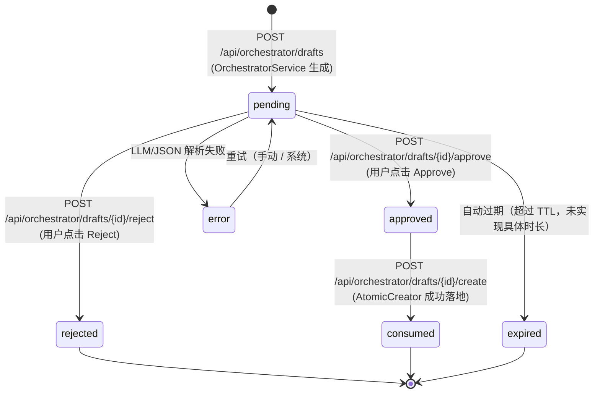
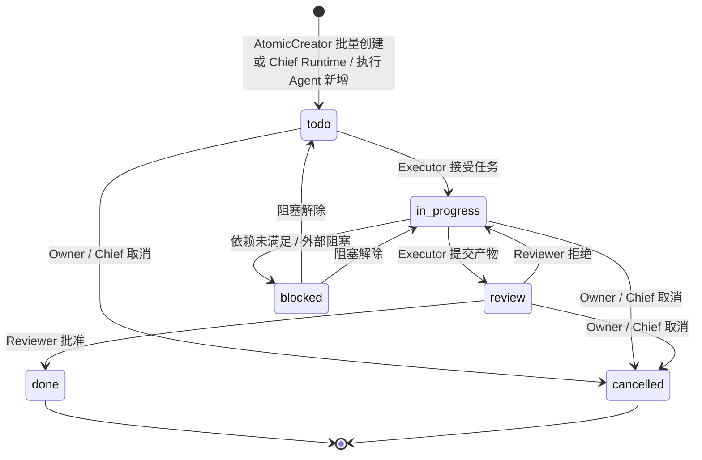
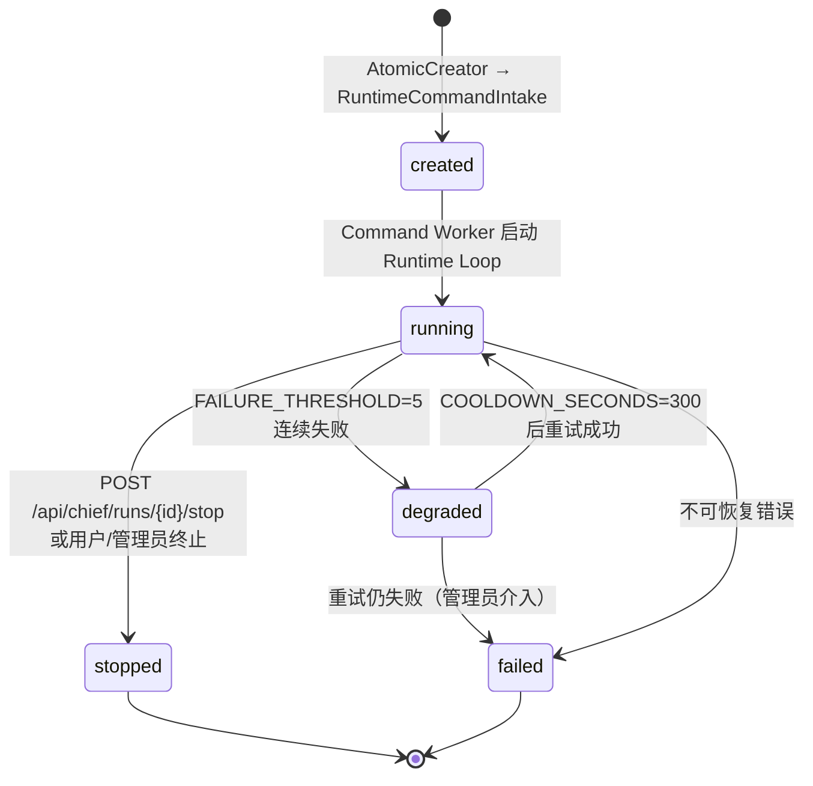
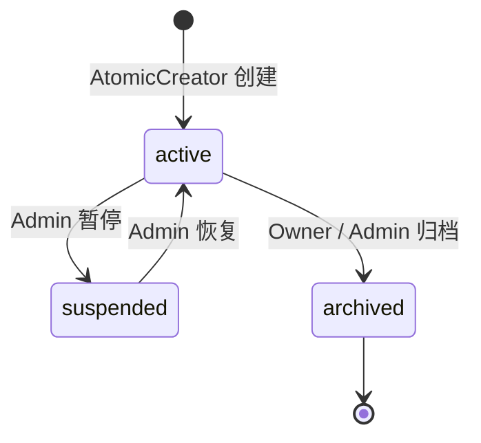
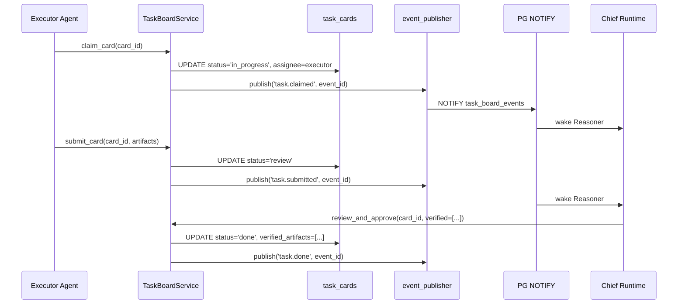
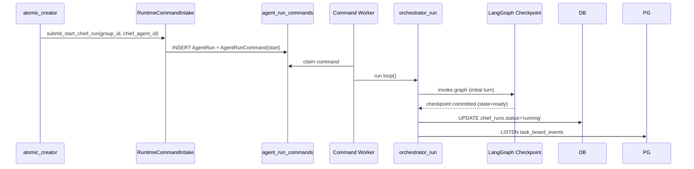

# 03 - State Machines

> **状态**: 🟡 DRAFT
> **范围**: Intent-Driven Project Orchestrator 模块的 4 个核心状态机

---

## 1. Draft 状态机

### 1.1 状态枚举
```
pending   → approved | rejected | expired | error
approved  → consumed
rejected  → (terminal)
consumed  → (terminal)
expired   → (terminal)
error     → pending  (重试; 由系统或用户触发)
```

### 1.2 状态转移图



### 1.3 状态转移表

| From | Event | To | 守卫 / 副作用 |
|---|---|---|---|
| (none) | proposeDraft | `pending` | LLM 多阶段推理成功；写 `drafts` 表 |
| `pending` | approveDraft | `approved` | 用户是 owner；写入 `approved_at`、`approved_by` |
| `pending` | rejectDraft | `rejected` | 用户是 owner；写入 `rejected_reason` |
| `pending` | TTL 超时 | `expired` | 自动 |
| `pending` | LLM 异常 / JSON 解析失败 | `error` | 写入 `error_message` |
| `error` | retry | `pending` | 用户触发；重新推理 |
| `approved` | createDraft | `consumed` | AtomicCreator 成功；幂等键 = `draft_id` |

### 1.4 不变量
- `consumed` → 任何写操作**直接拒绝**（409 Conflict）
- `approved → consumed` 是**单向**的；不能回退
- 用户只能 approve/reject **自己创建的** Draft（除非 admin）

---

## 2. TaskCard 状态机

### 2.1 状态枚举
```
todo → in_progress → review → done
              ↓           ↓
            blocked ←──────┘
              ↓
            (resolves → todo / in_progress)

todo → cancelled
in_progress → cancelled
review → cancelled
```

### 2.2 状态转移图



### 2.3 状态转移表

| From | Event | To | 守卫 |
|---|---|---|---|
| (none) | create_card | `todo` | 写入 `created_by`（system/executor/chief） |
| `todo` | claim | `in_progress` | 由 `assignee_participant_id` 接单 |
| `in_progress` | submit | `review` | 必须提交 `artifact_paths` |
| `in_progress` | block | `blocked` | 写入 `block_reason` |
| `review` | reject | `in_progress` | Reviewer 写入 `review_feedback` |
| `review` | approve | `done` | 必须含 `verified_artifacts` |
| `blocked` | unblock | `todo` 或 `in_progress` | 由 Chief 决定 |
| 任意非 done | cancel | `cancelled` | 由 Chief / Owner；`cancel_reason` 必填 |

### 2.4 字段约束
- `version int` — 乐观锁（每次 update +1）
- `assignee_participant_id` — 接单人（可选）
- `block_reason` / `cancel_reason` / `review_feedback` — 必填字符串
- `artifact_paths` — JSON 数组，存放在 group_file 内的路径

---

## 3. ChiefRun 状态机

### 3.1 状态枚举
```
created → running → stopped
   │         ↓
   │     degraded
   │         ↓
   │     running (cooldown 后恢复)
   │         ↓
   └───── failed
```

### 3.2 状态转移图



### 3.3 状态转移表

| From | Event | To | 副作用 |
|---|---|---|---|
| (none) | start_chief_run | `created` | 写 `chief_runs` 元数据；投递 command |
| `created` | start_loop | `running` | Worker 拉起 orchestrator_run |
| `running` | fail x N | `degraded` | N=5；写入 `last_failure_at`、`failure_reason` |
| `running` | stop | `stopped` | Worker 退出循环 |
| `degraded` | cooldown + ok | `running` | 重试成功 |
| `degraded` | cooldown + fail | `failed` | 需要人工介入 |
| `running` | unrecoverable | `failed` | 写入 `fatal_error` |

### 3.4 不变量
- `chief_runs` 表与 `groups` 表 **1:1**（UNIQUE group_id）
- 同一 group **不能** 同时有 2 个 running ChiefRun
- `chief_runs.status` 是元数据；实际执行进度在 LangGraph Checkpoint

---

## 4. Group（项目载体）状态机

### 4.1 状态枚举（与本模块相关的子集）
```
active → archived
active → suspended → active   (admin 操作)
```

### 4.2 状态转移图



### 4.3 与 Orchestrator 的关系
- Group 在 Orchestrator 模块的视角下，主要是「被管理的资源」：
  - 创建：通过 AtomicCreator
  - 暂停：可能让 Chief Runtime 暂时无法推进（实际机制待定 — 见 BUG-03-D）
  - 归档：Chief Runtime 应自动 `stopped`

---

## 5. 关键交互流程（高层序列）

### 5.1 Approve → Consume
```mermaid
sequenceDiagram
    participant U as User
    participant DP as DraftPreview UI
    participant API as /api/orchestrator/drafts
    participant DB as drafts 表
    U->>DP: 点击 Approve
    DP->>API: POST /drafts/{id}/approve
    API->>DB: UPDATE status='approved', approved_at=NOW
    API-->>DP: 200 OK
    U->>DP: 点击 Approve & Create
    DP->>API: POST /drafts/{id}/create
    API->>DB: BEGIN; SELECT FOR UPDATE
    API->>DB: AtomicCreator 落地
    API->>DB: UPDATE status='consumed'
    API->>DB: COMMIT
    API-->>DP: 201 {group_id, session_id, chief_run_id}
```

### 5.2 TaskCard 推进


### 5.3 Chief Runtime 启动


---

## 6. 已知 Bug / 待修复

- 🟡 **BUG-03-A**: `Draft.status='expired'` 的 TTL 时长**未在代码中找到明确定义**。需在 `draft.py` 模型或 orchestrator_service 中确认默认 TTL。
- 🟡 **BUG-03-B**: `TaskCard` 的「Reviewer」具体角色（Chief? Owner? 任意 member?）需要在 `task_board/service.py` 中确认。当前文档假设 Reviewer = Chief。
- 🟡 **BUG-03-C**: `ChiefRun` 的 `FAILURE_THRESHOLD=5` 和 `COOLDOWN_SECONDS=300` 是从 `04-orchestrator-tables.md` 中读到的常量，需确认 `orchestrator_run.py` 中实现值是否一致。
- 🟡 **BUG-03-D**: Group `suspended` 状态对 Chief Runtime 的影响（暂停 Runtime 循环 / 停止接收事件 / 完全无影响）**未在代码中直接验证**。当前文档标记为「实际机制待定」。
- 🟡 **BUG-03-E**: `chief_runs` 表的 1:1 关系（UNIQUE group_id）是否被数据库层 `UNIQUE` 约束保证，需要在 alembic migration 中确认（推测是应用层保证）。
- 🟡 **BUG-03-F**: TaskCard 的 `cancel` 权限（Owner / Chief / 任意 member）边界模糊，需要确认。
- 🟡 **BUG-03-G**: 状态机的「乐观锁」行为（`task_cards.version`）在 API 路由中的处理（409 vs 静默重试）需要在 `task_board.py` 路由中确认。