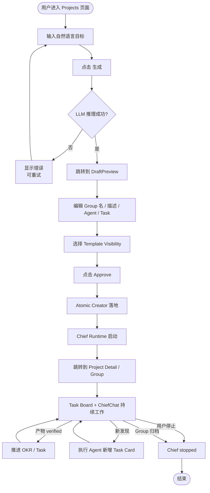
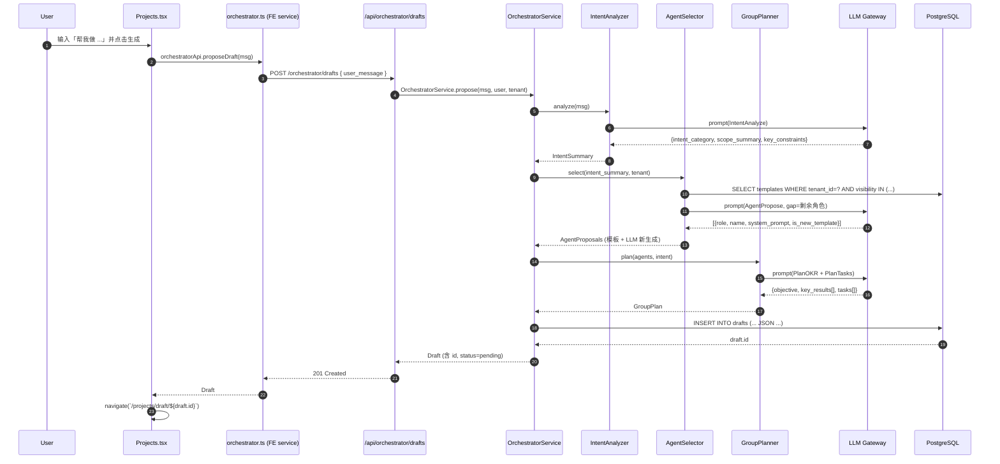
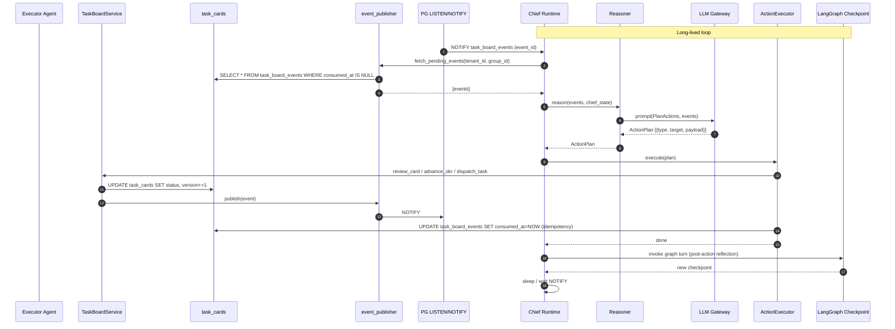
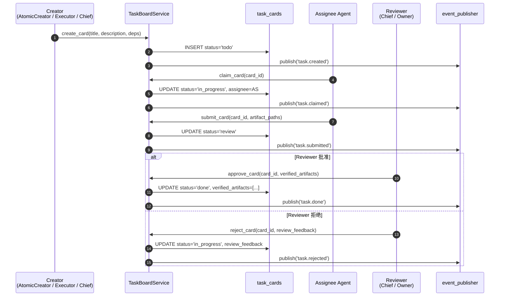
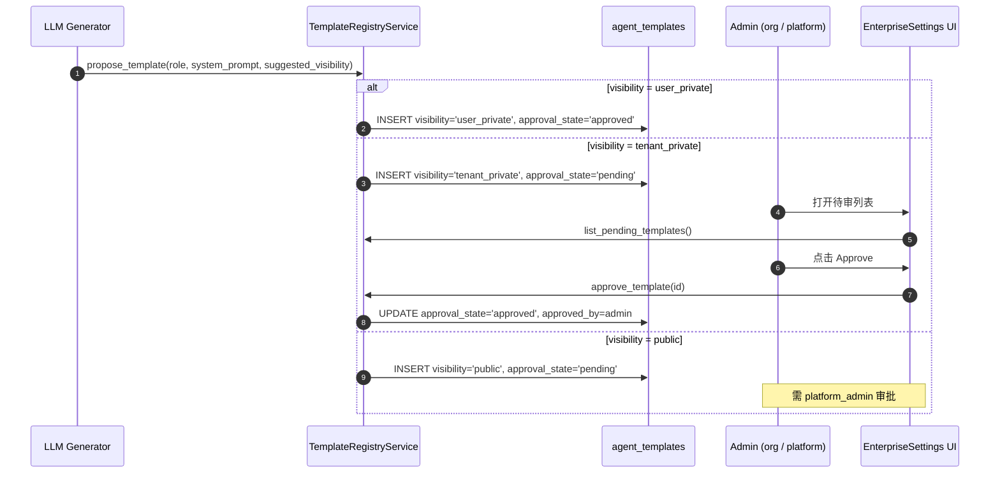
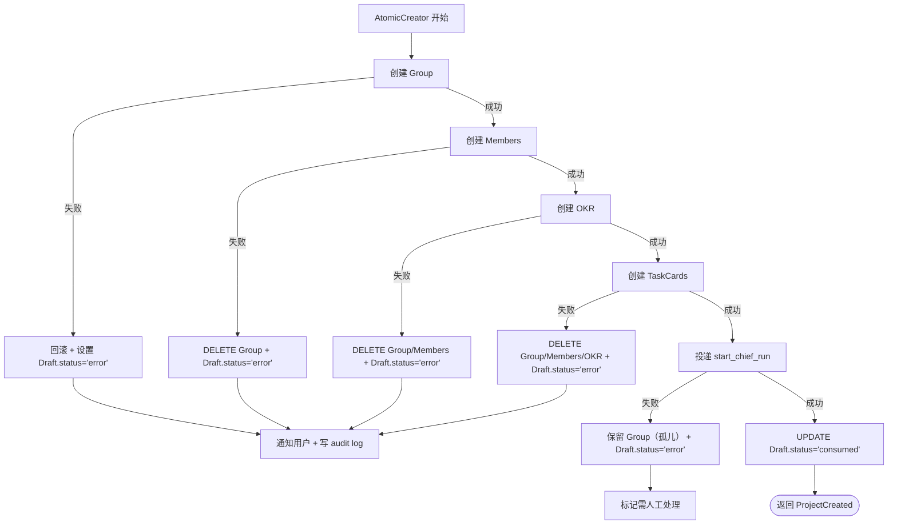
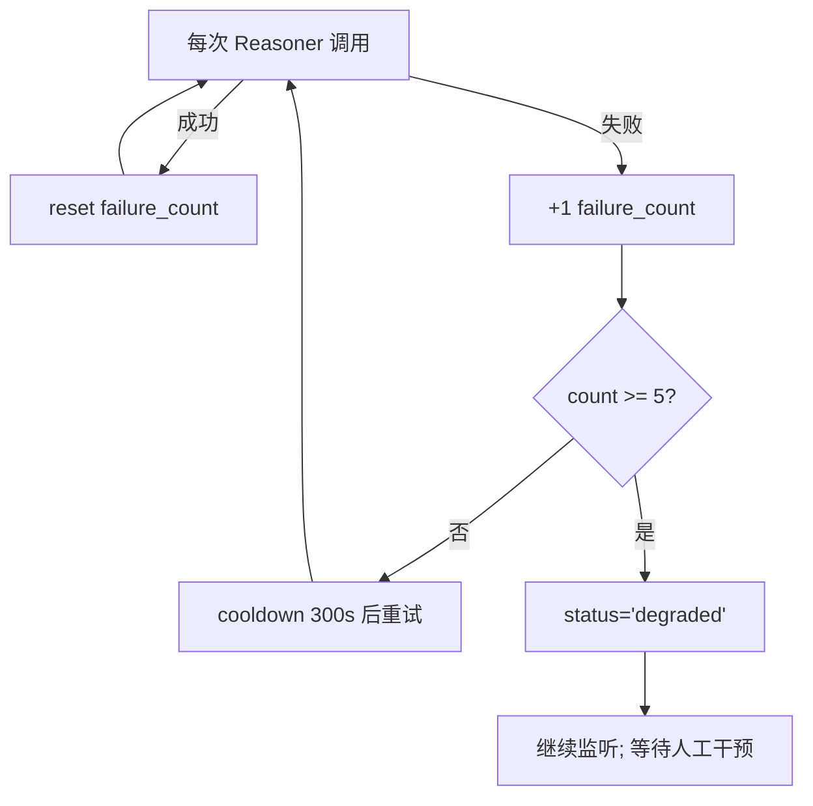

# 04 - End-to-End Flows & Sequence Diagrams

> **状态**: 🟡 DRAFT
> **范围**: Intent-Driven Project Orchestrator 的端到端流程

---

## 1. 总体旅程图（Activity Diagram）



---

## 2. 详细序列图：Draft 提案 → 落地

### 2.1 提案生成



### 2.2 审核 + 落地

```mermaid
sequenceDiagram
    autonumber
    participant U as User
    participant DP as DraftPreview.tsx
    participant OS as orchestrator.ts (FE)
    participant API as /api/orchestrator/drafts
    participant AC as atomic_creator (legacy / new)
    participant RCI as RuntimeCommandIntake
    participant ARC as agent_run_commands
    participant DB as PostgreSQL
    participant CH as Chief Runtime
    participant LG as LangGraph

    U->>DP: 编辑 visibility 选择 + 点 Approve
    DP->>OS: orchestratorApi.approveDraft(draftId)
    OS->>API: POST /orchestrator/drafts/{id}/approve
    API->>DB: UPDATE drafts SET status='approved', approved_at=NOW
    DB-->>API: OK
    API-->>OS: Draft (approved)

    U->>DP: 点 Approve & Create
    DP->>OS: orchestratorApi.createDraft(draftId)
    OS->>API: POST /orchestrator/drafts/{id}/create
    API->>DB: BEGIN; SELECT * FROM drafts WHERE id=? FOR UPDATE
    API->>AC: materialize(draft, user, tenant)
    AC->>DB: INSERT Group + GroupMembers (含 Chief)
    AC->>DB: INSERT Agent (从模板克隆或新生成)
    AC->>DB: INSERT OKR (objective + key_results)
    AC->>DB: INSERT TaskCards (批量, status='todo')
    AC->>DB: INSERT TaskCardDependencies
    AC->>DB: INSERT chief_runs (status='created')
    AC->>RCI: submit_start_chief_run(group_id, chief_agent_id)
    RCI->>ARC: INSERT AgentRun + AgentRunCommand(start)
    AC->>DB: UPDATE drafts SET status='consumed'
    AC->>DB: COMMIT
    AC-->>API: {group_id, session_id, chief_run_id, okr_objective_id, task_card_ids}
    API-->>OS: ProjectCreated
    OS-->>DP: ProjectCreated
    DP->>DP: navigate(`/groups/${group_id}?session=${session_id}&name=...`)

    Note over CH,LG: 异步 - 后台
    ARC-->>CH: Command Worker picks up
    CH->>LG: invoke graph turn
    LG-->>CH: checkpoint (state=ready)
    CH->>DB: UPDATE chief_runs SET status='running'
```

---

## 3. 详细序列图：Chief Runtime 持续调度



---

## 4. 详细序列图：TaskCard 生命周期



---

## 5. 详细序列图：模板可见性审核



---

## 6. 错误流：Draft 落地失败



---

## 7. 错误流：Chief Runtime 持续失败



---

## 8. 错误流：Draft 过期 / 重复提交

```mermaid
flowchart TD
    Submit[POST /drafts/{id}/create] --> S1{status 是什么?}
    S1 -->|pending| E1[403 需先 approve]
    S1 -->|approved| S2[进入落地流程]
    S1 -->|consumed| E2[409 已落地，幂等拒绝]
    S1 -->|rejected/expired| E3[400 状态不允许]
    S1 -->|error| E4[409 错误状态，需先重试]
```

---

## 9. 已知 Bug / 待修复

- 🟡 **BUG-04-A**: 上述 `OrchestratorService.propose` 流程中的具体 LLM prompt 模板未在文档中给出，隐藏在 `intent_analyzer.py` / `agent_selector.py` / `group_planner.py` 中。需要后续 review 时把这些 prompt 也纳入 spec。
- 🟡 **BUG-04-B**: 序列图 5.2 中 `atomic_creator (legacy / new)` — README 提到 `atomic_creator.py` 被标记为 LEGACY，但 git 修改显示 `orchestrator.py` 重写了相关逻辑，**实际替代实现的路径**需要在文档中明确。
- 🟡 **BUG-04-C**: 序列图 5.3 中 `Reasoner` 的 prompt 与 `ActionExecutor` 的实际行为（review vs dispatch vs advance_okr）**未在代码中完全验证**，文档基于已有 spec 推测。
- 🟡 **BUG-04-D**: 错误流 6 中「保留 Group（孤儿）」是否被接受（避免回滚成本）需要在 atomic_creator 实现中确认。
- 🟡 **BUG-04-E**: 序列图 2.1 中「AgentSelector 从模板 + LLM 生成混合选择」的优先级规则（先填模板再补 LLM？按 role 匹配？按 tenant 默认？**未完全验证**）。
- 🟡 **BUG-04-F**: 序列图 2.2 中 `submit_start_chief_run` 后立即 UPDATE `chief_runs.status='running'` — 实际可能是异步的（worker 拉起后才更新），文档基于同步视角。